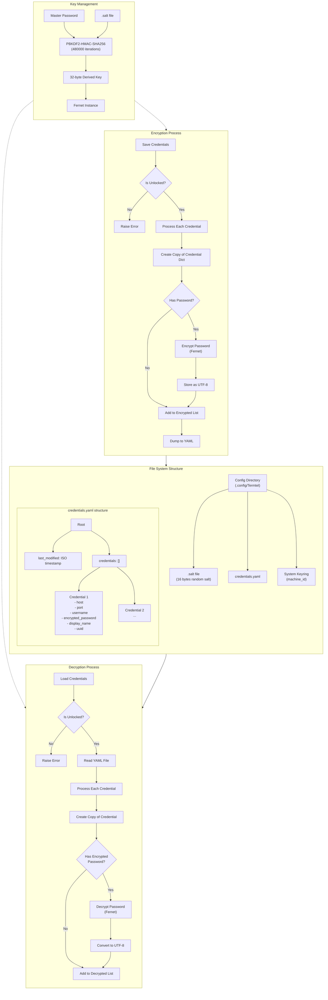

# TerminalTelemetry

A modern, cyberpunk-inspired terminal emulator with integrated network device monitoring capabilities. This application combines terminal functionality with real-time network telemetry in a highly customizable interface.


## Installation

### From PyPI

```bash
pip install TerminalTelemetry
```

### From GitHub

```bash
git clone https://github.com/scottpeterman/termtel.git
cd termtel
pip install -r requirements.txt

```

#### to launch
```commandline
python -m termtel.termtel
# or
termtel
```
## Features

- **Modern Terminal Emulator**
  - Multi-session support with tabbed interface
  - Customizable themes (Cyberpunk, Dark Mode, Light Mode, Retro Green, Retro Amber, Neon Blue)
  - Session management and quick connect functionality
  - Secure credential storage

- **Network Device Telemetry**
  - Real-time interface utilization monitoring with graphs
  - Automatic device type detection
  - LLDP/CDP neighbor discovery
  - ARP table visualization
  - Routing table analysis with prefix lookup
  - Support for multiple network operating systems (Cisco IOS, Arista EOS, Cisco NXOS)

- **Security Features**
  - PBKDF2-HMAC-SHA256 key derivation (480,000 iterations)
  - Fernet (AES-128-CBC) encryption with HMAC authentication
  - Platform-specific secure storage locations
  - Machine-specific binding
  - Rate-limited authentication
  - Cross-platform secure credential management
  - Zero plaintext storage of sensitive data




### Requirements

- Python 3.9 or higher
- PyQt6
- Additional dependencies will be automatically installed

## Usage

After installation, you can launch TerminalTelemetry using either of these commands:

```bash
# Launch with console
termtel

```

### First Time Setup

1. When first launched, you'll be prompted to create a master password for secure credential storage
   - The master password is used with PBKDF2 key derivation
   - A unique salt is generated and stored securely
   - Credentials are encrypted using Fernet (AES-128-CBC)

2. Credentials are stored securely based on your platform:
   - Windows: Uses APPDATA directory and MachineGuid
   - macOS: Uses Application Support directory and hardware serial
   - Linux: Uses .config directory and machine-id

3. Connect to devices using the connection panel
   - Credentials are encrypted at rest
   - Session data is protected in memory
   - Machine-specific binding prevents credential theft

### Theme Selection

The application supports multiple themes which can be selected from the menu:
- Cyberpunk (Default)
- Dark Mode
- Light Mode
- Retro Green
- Retro Amber
- Neon Blue

## Development

To set up a development environment:

```bash
git clone https://github.com/scottpeterman/termtel.git
cd termtel
python -m venv venv
source venv/bin/activate  # On Windows: venv\Scripts\activate
pip install -e .[dev]
```

### Security Considerations for Development

When contributing, ensure:
1. All cryptographic operations use approved algorithms
2. Platform-specific code is properly isolated
3. Error handling follows security best practices
4. Regular security audits are performed
5. Dependencies are kept updated

## Configuration

The application stores its configuration in platform-specific locations:

```
Windows: %APPDATA%/TerminalTelemetry/
macOS: ~/Library/Application Support/TerminalTelemetry/
Linux: ~/.config/TerminalTelemetry/
```

## License

This project is licensed under the GNU General Public License v3 (GPLv3).

## Author

Scott Peterman (github.com/scottpeterman)

## Acknowledgments

- PyQt6 for the GUI framework
- NAPALM for network device interaction
- paramiko for all things SSH
- TextFSM, thanks for the templates
- The open-source community for various supporting libraries