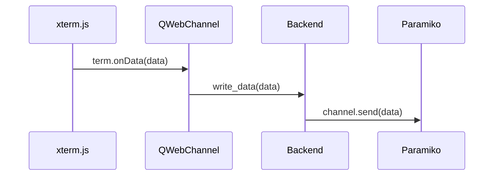
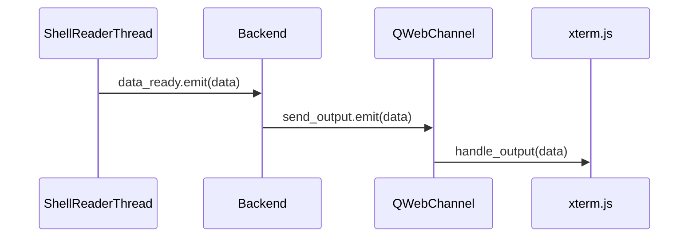

# JavaScript Bridge: xterm.js to Paramiko I/O

This document explains how the JavaScript bridge enables bidirectional communication between xterm.js running in QWebEngineView and the Paramiko SSH backend using QWebChannel.

## Architecture Overview

The bridge consists of three main components:
1. Frontend (xterm.js in HTML/JavaScript)
2. Bridge (QWebChannel)
3. Backend (Python/Paramiko)

## Setup Process

### 1. Backend Registration

```python
# In Ui_Terminal class
def setupUi(self, term):
    # Create the channel and register the backend
    self.channel = QWebChannel()
    self.backend = Backend(host, username, password, port)
    self.channel.registerObject("backend", self.backend)
    
    # Set up the web view
    self.view = QWebEngineView()
    self.view.page().setWebChannel(self.channel)
```

### 2. HTML/JavaScript Setup

```html
<!-- qtsshcon.html -->
<!DOCTYPE html>
<html>
<head>
    <script src="qwebchannel.js"></script>
    <script src="xterm.js"></script>
    <script>
        // Initialize QWebChannel
        new QWebChannel(qt.webChannelTransport, function(channel) {
            window.backend = channel.objects.backend;
            initTerminal();
        });
    </script>
</head>
<body>
    <div id="terminal"></div>
</body>
</html>
```

### 3. Terminal Initialization

```javascript
function initTerminal() {
    // Create xterm.js instance
    var term = new Terminal();
    term.open(document.getElementById('terminal'));

    // Handle terminal input
    term.onData(function(data) {
        // Send data to Python backend
        backend.write_data(data);
    });

    // Handle terminal resize
    term.onResize(function(size) {
        backend.set_pty_size(
            "cols:" + size.cols + "::" +
            "rows:" + size.rows
        );
    });

    // Handle data from Python
    window.handle_output = function(data) {
        term.write(data);
    };
}
```

## Data Flow

### 1. Terminal Input to SSH (JavaScript → Python)


### 2. SSH Output to Terminal (Python → JavaScript)


## Key Components

### Backend Class (Python)
```python
class Backend(QObject):
    send_output = pyqtSignal(str)

    @pyqtSlot(str)
    def write_data(self, data):
        if self.channel and self.channel.send_ready():
            self.channel.send(data)

    @pyqtSlot(str)
    def set_pty_size(self, data):
        if self.channel:
            cols = int(data.split("::")[0].split(":")[1])
            rows = int(data.split("::")[1].split(":")[1])
            self.channel.resize_pty(width=cols, height=rows)
```

### ShellReaderThread (Python)
```python
class ShellReaderThread(QThread):
    data_ready = pyqtSignal(str)

    def run(self):
        while not self.channel.closed:
            if data := self.channel.recv(1024):
                self.data_ready.emit(data.decode())
```

## Signal/Slot Connections

1. **Terminal Input**
   - JavaScript `onData` → Python `@pyqtSlot(str) write_data`
   - Python `write_data` → Paramiko `channel.send`

2. **Terminal Output**
   - Paramiko `channel.recv` → Python `data_ready.emit`
   - Python `send_output.emit` → JavaScript `handle_output`

3. **Terminal Resize**
   - JavaScript `onResize` → Python `@pyqtSlot(str) set_pty_size`
   - Python `set_pty_size` → Paramiko `resize_pty`

## Best Practices

1. **Error Handling**
   ```python
   @pyqtSlot(str)
   def write_data(self, data):
       try:
           if self.channel and self.channel.send_ready():
               self.channel.send(data)
       except paramiko.SSHException as e:
           print(f"Error writing to channel: {e}")
   ```

2. **Resource Cleanup**
   ```python
   def cleanup(self):
       if self.channel:
           self.channel.close()
       if self.client:
           self.client.close()
   ```

3. **Data Validation**
   ```javascript
   // Validate data before sending to backend
   term.onData(function(data) {
       if (data && backend) {
           backend.write_data(data);
       }
   });
   ```

## Common Issues and Solutions

1. **Channel Not Ready**
   - Always check `channel.send_ready()` before sending data
   - Implement retry mechanism for failed sends

2. **Unicode Handling**
   ```python
   # In ShellReaderThread
   data_decoded = data.decode('utf-8', 'ignore')
   self.data_ready.emit(data_decoded)
   ```

3. **Terminal Size Synchronization**
   - Send initial size on terminal creation
   - Handle resize events promptly
   - Verify size values before applying

## Security Considerations

1. **Data Sanitization**
   - Sanitize input data before sending to SSH
   - Handle special characters properly

2. **Connection Security**
   - Use secure authentication methods
   - Implement timeout mechanisms
   - Handle connection drops gracefully

## Testing

1. **Bridge Communication**
   ```python
   # Test backend registration
   assert hasattr(window, 'backend')
   
   # Test data flow
   backend.write_data('test')
   assert channel.last_sent == 'test'
   ```

2. **Error Cases**
   - Test connection drops
   - Test invalid data handling
   - Test resize edge cases